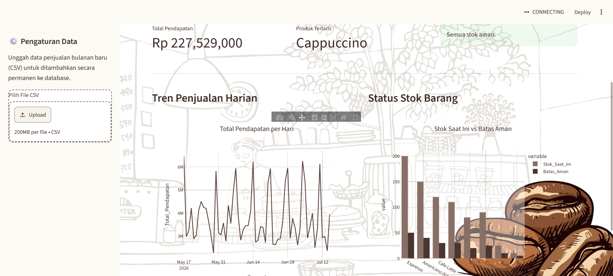
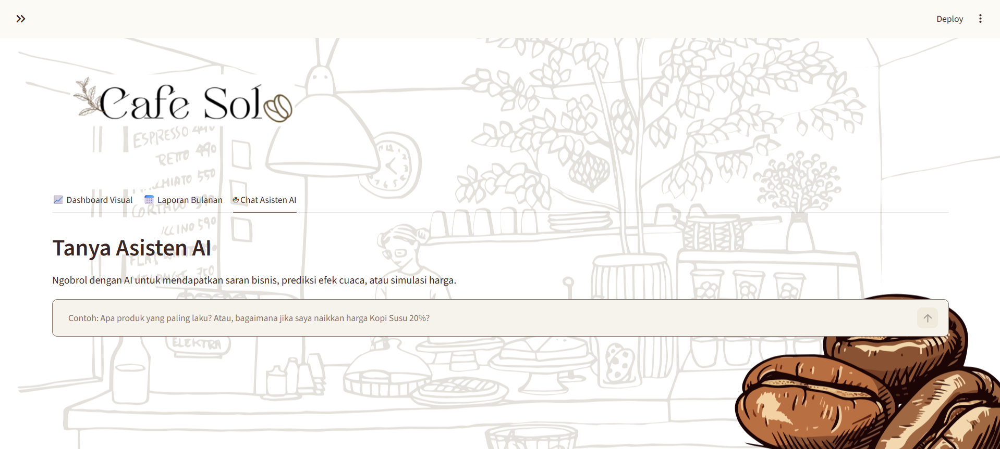
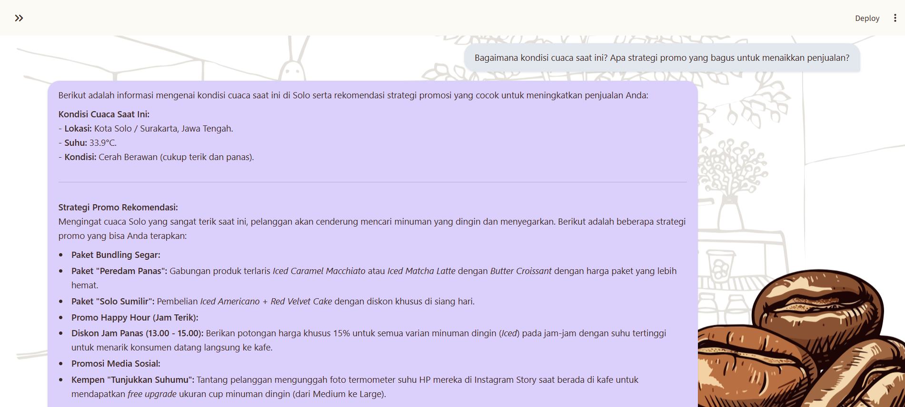

# 📊 Dashboard Analis AI - UMKM

Sebuah aplikasi web interaktif berbasis **Streamlit** yang dirancang khusus untuk pemilik UMKM (khususnya *Coffee Shop*). Aplikasi ini tidak hanya menampilkan visualisasi data penjualan dan stok barang secara *real-time*, tetapi juga dilengkapi dengan **Asisten AI Cerdas** (berbasis Google Gemini) yang siap memberikan analisis mendalam, saran bisnis, dan simulasi *What-If* berdasarkan kondisi cuaca serta tren penjualan.

---

## ✨ Fitur Utama

1. **📈 Dashboard Visual Interaktif**
   - Pantau total pendapatan selama **1 Tahun Terakhir** dan metrik utama secara instan.
   - Grafik tren penjualan harian yang memukau.
   - Peringatan dini (*early warning*) untuk stok barang yang sudah menipis.

2. **📅 Laporan Bulanan Dinamis**
   - Ringkasan performa penjualan khusus untuk bulan berjalan.
   - Rincian penjualan per menu (jumlah porsi dan total pendapatan) yang diurutkan dari produk terlaris.

3. **🤖 Chat Asisten AI**
   - Ngobrol langsung dengan AI yang sudah memahami seluruh data penjualan dan stok toko selama setahun.
   - **Integrasi Cuaca Real-Time**: AI terhubung dengan satelit *Open-Meteo API* untuk menarik data cuaca dan suhu Kota Solo secara *live*, sehingga saran promosi yang diberikan selalu sangat relevan dengan cuaca detik ini.
   - Tanyakan simulasi harga ("Bagaimana jika harga Kopi Susu naik 20%?") dan AI akan menghitung prediksinya.
   - UI obrolan yang elegan mirip dengan media sosial (sistem *bubble chat*).

4. **⚙️ Manajemen Data Mandiri (Unggah CSV)**
   - Fitur untuk mengunggah rekap data penjualan bulan-bulan baru secara mandiri.
   - Sistem cerdas yang akan memvalidasi, menggabungkan data, dan me-reload *dashboard* serta memori AI seketika itu juga.

---

## 📸 Tangkapan Layar (Screenshots)

*Tampilan Antarmuka Dasbor Utama & Laporan Bulanan:*


*Tampilan Obrolan Bersama Asisten AI:*




---

## 🛠️ Teknologi yang Digunakan (Tech Stack)

- **Bahasa Pemrograman:** Python 3.9+
- **Antarmuka Web (UI):** Streamlit
- **Pengolahan Data:** Pandas
- **API & HTTP Client:** Requests (Open-Meteo API)
- **Visualisasi Data:** Plotly Express
- **AI & LLM:** LangChain & Google Generative AI (Gemini 1.5 Flash)
- **Styling:** Custom CSS (Glassmorphism & Coffee Theme)

---

## 🚀 Cara Instalasi & Menjalankan Aplikasi Lokal

1. **Clone repositori ini** (atau unduh file-filenya):
   ```bash
   git clone https://github.com/nalarohmah/SoloCafe.git
   cd SoloCafe
   ```

2. **Install semua modul yang dibutuhkan**:
   Pastikan Anda sudah menginstal Python, lalu jalankan:
   ```bash
   pip install -r requirements.txt
   ```

3. **Siapkan API Key Gemini**:
   - Dapatkan API Key secara gratis dari [Google AI Studio](https://aistudio.google.com/).
   - Buat file bernama `.env` di folder utama aplikasi ini.
   - Isi file tersebut dengan format berikut:
     ```env
     GOOGLE_API_KEY=masukkan_api_key_anda_disini
     ```

4. **Jalankan Aplikasi**:
   ```bash
   streamlit run app.py
   ```
   Aplikasi akan otomatis terbuka di browser Anda (biasanya di `http://localhost:8501`).

---

## 📂 Struktur Direktori

```text
📁 SoloCafe
├── 📄 app.py                   # File utama aplikasi Streamlit
├── 📄 generate_data.py         # Skrip generator data fiktif CSV (1 Tahun)
├── 📄 penjualan_coffee.csv     # Database utama penjualan
├── 📄 stok_barang_coffee.csv   # Database status stok barang
├── 📄 requirements.txt         # Daftar pustaka (library) Python
├── 📄 .env                     # File rahasia untuk API Key (jangan di-upload!)
└── 📁 assets/                  # Folder untuk logo, background, dan screenshot
    ├── logo.png
    └── background.png
```

## 🤝 Kontribusi
Jika Anda memiliki ide fitur lain atau menemukan *bug*, silakan buka *Issue* atau kirimkan *Pull Request*!

---
*Dibuat dengan ❤️ untuk kemajuan UMKM Indonesia.*
